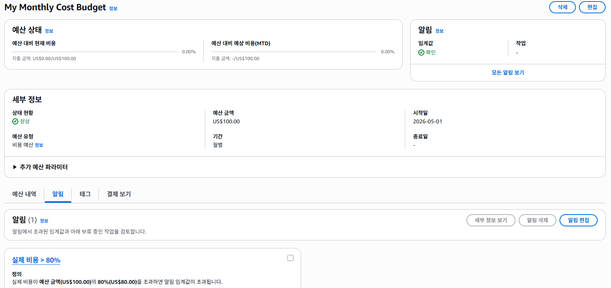
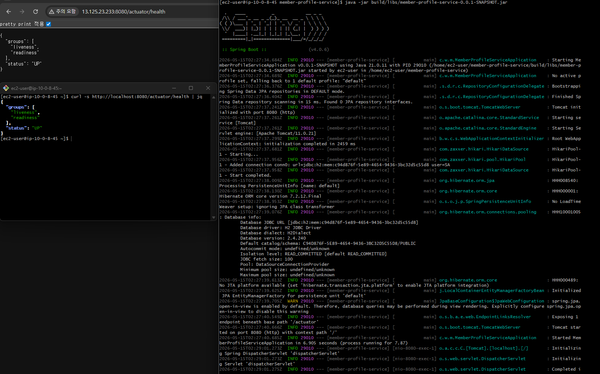
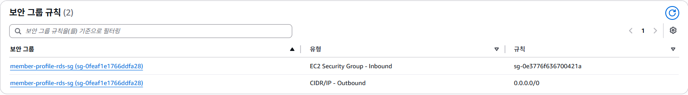
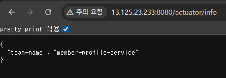
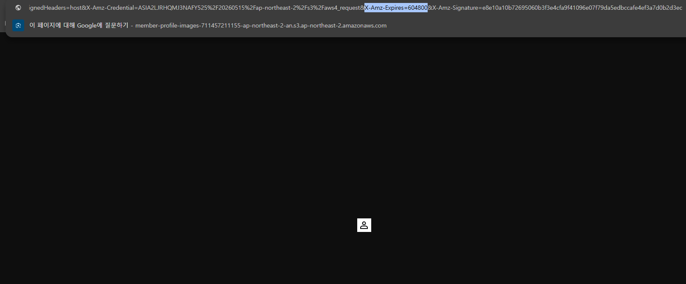
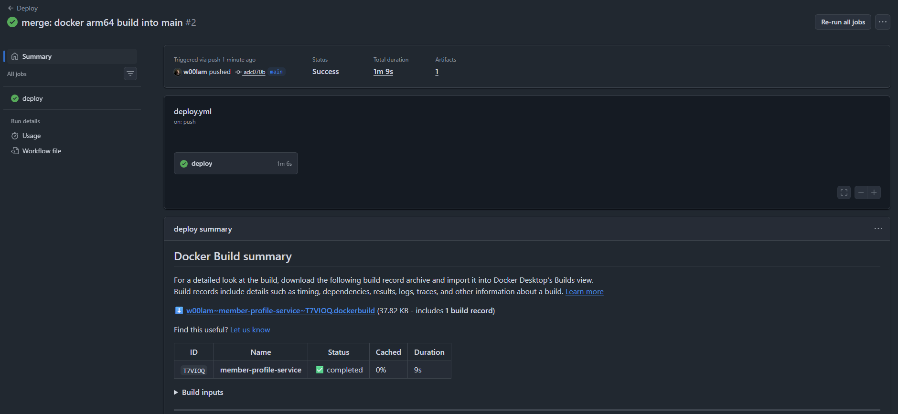
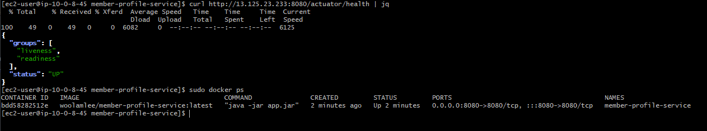
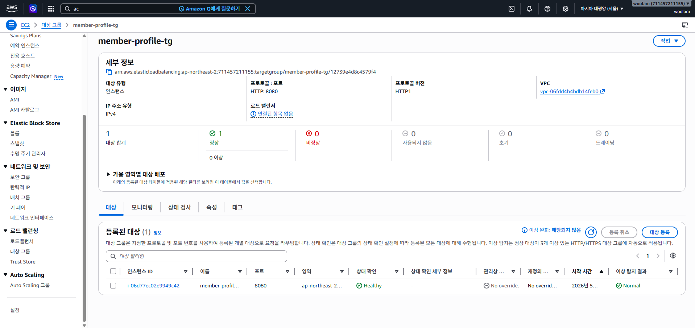
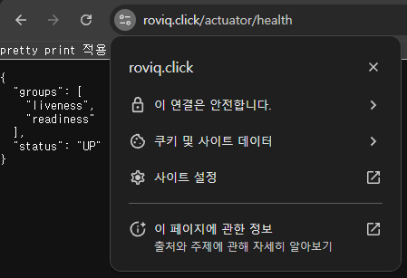
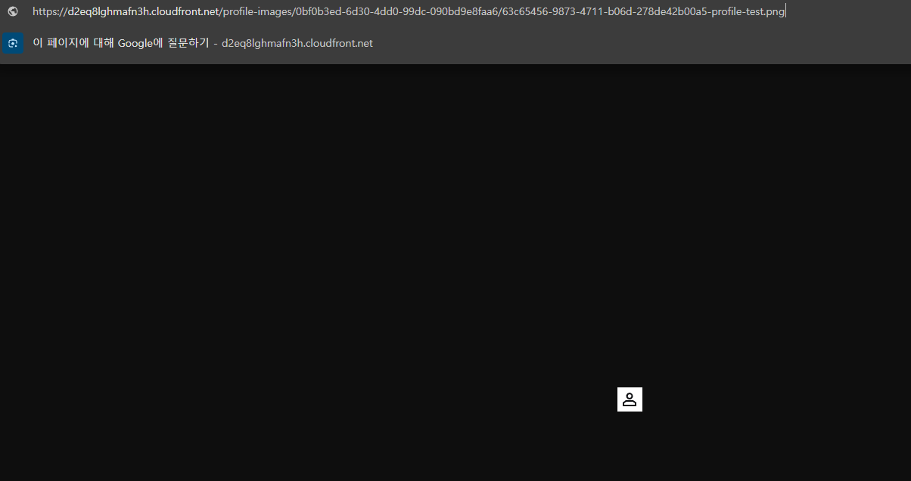

# Member Profile Service

## 🚀 프로젝트 소개

이 프로젝트는 스타트업 백엔드 개발자로서 팀원들의 정보를 저장하고 프로필 사진을 업로드하는 API를 구축하고, 이를 AWS 상에서 안전하고 중단 없이 운영하는 것을 목표로 합니다. 아무것도 없는 상태에서 네트워크를 구축하고, DB와 파일 저장소를 분리하여 "서버가 죽어도 데이터가 안전한" Stateless 아키텍처를 완성하는 데 중점을 두었습니다.

상세한 트러블슈팅 과정과 기술적 고민은 [블로그 포스팅: 실전 클라우드 배포와 운영](https://w00lam.github.io/posts/cloud-deployment-troubleshooting/)에서도 확인하실 수 있습니다.

### 기술 스택

*   **백엔드**: Spring Boot 3.x, Java 21, Gradle
*   **데이터베이스**: MySQL (RDS), H2 Database (로컬 개발)
*   **클라우드**: AWS (EC2, RDS, S3, Parameter Store, ALB, ASG, CloudFront, Route 53, ACM, IAM, Budgets)
*   **CI/CD**: GitHub Actions, Docker, Docker Hub

## ✨ 주요 기능 (필수 과제)

### LV 0 - 요금 폭탄 방지 AWS Budget 설정

클라우드 실습 중 가장 중요한 비용 관리를 위해 AWS Budgets를 설정했습니다. 월 예산을 $100로 설정하고, 예산의 80% 도달 시 이메일 알림이 오도록 구성했습니다.

### LV 1 - 네트워크 구축 및 핵심 기능 배포

안전한 네트워크 환경을 구축하고, '운영 가능한 상태'의 애플리케이션을 배포하여 외부 접속을 확인합니다.

*   **인프라 구축 (VPC & EC2)**
    *   VPC를 설정하여 Public/Private Subnet 분리
    *   Public Subnet에 EC2 생성
*   **애플리케이션 개발 (API & Actuator)**
    *   팀원 정보 저장 및 조회 API 개발 (`POST /api/members`, `GET /api/members/{id}`)
    *   로컬은 H2, 운영은 MySQL을 사용하도록 `application.yml`을 `local/prod`로 분리
    *   API 요청 시 `INFO` 레벨 로그, 예외 발생 시 `ERROR` 레벨 스택트레이스 로그 남기기
    *   `spring-boot-starter-actuator` 의존성 추가 및 헬스 체크 엔드포인트 노출
*   **배포 및 검증**: EC2에 프로젝트 배포 및 실행, `/actuator/health` 엔드포인트 응답 확인

### LV 2 - DB 분리 및 보안 연결

DB 비밀번호를 코드에 직접 노출하지 않고, AWS 관리형 서비스를 이용해 안전하게 배포합니다.

*   **인프라 요구사항**
    *   로컬 접속용 Public Subnet에 MySQL RDS 생성
    *   RDS 보안 그룹(Inbound)에 EC2의 보안 그룹 ID만 허용하는 보안 그룹 체이닝 설정
    *   DB 접속 정보 및 확인용 파라미터를 Parameter Store에 저장
*   **애플리케이션 요구사항**
    *   Spring Boot 실행 시 Parameter Store 값을 주입받아 RDS에 연결
    *   Parameter Store에 저장한 `team-name` 값이 `/actuator/info` 엔드포인트에서 조회되도록 Actuator Info 확장

### LV 3 - 프로필 사진 기능 추가와 권한 관리

팀원 정보에 프로필 사진 기능을 추가하고, 서버 디스크가 아닌 S3를 사용하여 데이터의 안전성을 확보합니다.

*   **인프라 요구사항**
    *   S3 버킷 생성 (퍼블릭 액세스 차단)
    *   S3 접근 권한이 있는 IAM Role 생성 및 EC2에 연결
*   **API 요구사항**
    *   `POST /api/members/{id}/profile-image`: S3 이미지 업로드 및 URL DB 업데이트
    *   `GET /api/members/{id}/profile-image`: Presigned URL 생성 (유효기간 7일)

## 💡 도전 과제

### LV 4 - Docker & CI/CD 파이프라인 구축

애플리케이션을 컨테이너 환경으로 포장하고, 코드 푸시 한 번으로 배포까지 완료되는 자동화를 구축합니다.

*   **Docker 도입**: `Dockerfile` 작성 및 이미지 빌드
*   **Github Actions CI/CD**: Main 브랜치 푸시 시 빌드, 테스트 및 Docker Hub 푸시, EC2 자동 배포

### LV 5 - 고가용성 아키텍처와 보안 도메인 연결 (ALB + ASG + HTTPS)

트래픽 급증에 대비한 확장성(Auto Scaling)과 보안(HTTPS)을 확보하고, 외우기 쉬운 도메인을 연결합니다.

*   **NAT Gateway 및 Private Subnet**: 보안 강화를 위해 RDS & EC2를 Private Subnet으로 이동
*   **ALB & ASG**: HTTPS 적용 및 트래픽에 따른 자동 확장 구성
*   **Route 53 & ACM**: 도메인 연결 및 SSL 인증서 적용

### LV 6 - 글로벌 성능 최적화 (CloudFront CDN)

전 세계 어디서든 프로필 사진을 빠르게 볼 수 있도록 CDN을 적용합니다.

*   **CloudFront 구축**: S3 원본 CloudFront 배포 생성 및 도메인을 통한 이미지 조회

## 🛠️ 트러블슈팅 및 학습 경험

프로젝트를 진행하면서 마주했던 주요 문제 상황과 해결 과정, 그리고 이를 통해 얻은 학습 경험을 공유합니다.

### 1. ID 전략 및 데이터 설계 고민: UUID 도입

일반적인 `Long` Auto Increment ID 대신 `UUID` 기반으로 회원 ID를 구현했습니다. 이는 클라우드 기반의 확장 가능한 환경을 고려한 선택이었습니다. 

*   **UUID를 선택한 이유**: 애플리케이션 레벨에서 고유 ID를 생성하여 여러 서버 인스턴스에서 ID 충돌 가능성을 낮추고, 데이터 생성 순서 노출 및 리소스 ID 예측 가능성 문제를 방지하기 위함입니다.
*   **저장 방식 고민**: `BINARY(16)`이 효율적이지만, 운영 중 DB 조회 가독성과 디버깅 편의성을 위해 `CHAR(36)` 문자열 방식을 선택했습니다.

### 2. 유지보수성 고려: 에러 코드를 도메인별로 분리한 이유

이전 프로젝트에서 모든 에러 코드를 하나의 `ErrorCode`에서 관리했을 때 발생했던 Git 충돌과 도메인 경계 모호화 문제를 해결하기 위해 에러 코드를 도메인별로 분리했습니다. 현재 `MemberErrorCode`를 독립적으로 관리하며, 이를 통해 도메인 책임 분리와 유지보수성을 개선했습니다.

### 3. 로컬에서는 정상인데 운영 환경(RDS)에서만 실패했던 UUID 문제

회원 생성 API가 로컬(H2)에서는 정상 동작했지만, AWS RDS(MySQL) 환경에서 `Incorrect string value` 에러가 발생했습니다. Hibernate 7의 UUID 저장 전략과 MySQL 컬럼 타입 불일치(`CHAR(36)` vs `BINARY(16)`)가 원인이었으며, 이를 통해 Hibernate 매핑 전략과 DB Dialect 차이를 실제 운영 DB 관점에서 고려해야 함을 배웠습니다.

### 4. Gradle Daemon 때문에 발생했던 Java 21 인식 문제

EC2에서 빌드 중 Java 21 설치 상태임에도 JDK를 찾지 못하는 에러가 발생했습니다. 원인은 Gradle Daemon의 이전 환경 정보 캐싱이었으며, `./gradlew --stop`으로 Daemon을 재시작하여 해결했습니다. 이 과정을 통해 `javac -version` 확인 및 빌드 툴의 캐시 메커니즘 이해의 중요성을 깨달았습니다.

### 5. Docker 아키텍처 불일치 문제 (amd64 vs arm64)

GitHub Actions에서 빌드한 Docker 이미지가 EC2에서 `exec format error`로 실행되지 않는 문제를 겪었습니다. 빌드 환경(`amd64`)과 실행 환경(`arm64`)의 아키텍처 차이가 원인이었으며, 빌드 플랫폼을 `linux/arm64`로 명시하여 해결했습니다. Docker가 "어디서든 실행된다"는 원칙 뒤에 CPU 아키텍처 호환성이 전제되어야 함을 체감했습니다.

### 6. ALB Target Group이 Unhealthy였던 원인

ALB Health Check 실패의 근본 원인이 Security Group 설정 오류로 인한 DB 연결 실패였음을 발견했습니다. `EC2 SG → RDS SG` 인바운드 규칙이 누락되어 애플리케이션 부팅이 실패했고, 이것이 연쇄적으로 ALB Health Check 실패로 이어졌습니다. 네트워크 보안 그룹 체이닝과 애플리케이션 의존성 구조를 전체적으로 조망하는 시야를 기를 수 있었습니다.

### 7. HTTP Multipart 구조의 이해: @RequestPart 활용

프로필 이미지 업로드 API 구현 시 `multipart/form-data` 구조를 깊이 있게 학습했습니다. 단순 `@RequestParam` 대신 `@RequestPart`를 사용하여 요청 구조를 명확히 하고, 향후 JSON과 파일을 동시에 처리하는 확장성 있는 API 구조를 설계하는 경험을 쌓았습니다.

---
